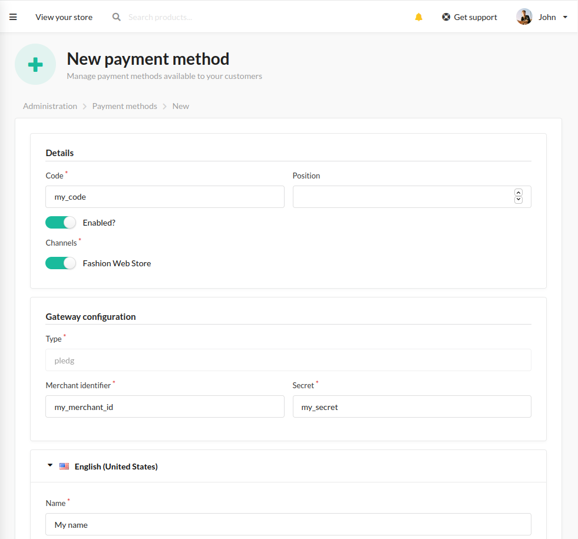

# Payment Gateway Plugin using Pledg

## Installation

1. Install the package
   
```bash
    composer require pledg/sylius-payment-plugin
```

2. Import routes in one of your routing file or create a new one (like `config/routes/pledg_sylius_payment.yaml`)

```yaml
    pledg_sylius_payment:
        resource: "@PledgSyliusPaymentPlugin/Resources/config/routing.yml"
        prefix: /pledg
```

3. Clear your cache in order to see translations

```bash
    bin/console c:c
```

## Sandbox and production environment

By default, plugin uses sandbox mode. You can configure it by specify the mode in your configuration files.
For example if you only want to disable the sandbox mode for the production environment you just have to create a `config/packages/prod/pledg_sylius_payment_plugin.yaml` file with : 
    
```yaml
    pledg_sylius_payment:
        sandbox: false
```

## Create your payment method

Now you can use the plugin and create your first Pledg Payment method :

1. Select the Pledg Type 


2. Fill all required fields (specially with your merchant id and secret) and don't forget to activate the method on your channel.



Pledg allow to use a payment method without a signature but the plugin does not allow it. 
So even in sandbox mode, the secret is required and exchanges will be signed.

Now you just have to use it.


## How the plugin works ?

We use Payum and the Sylius payment workflow in order to redirect on the Pledg payment page.
Pledg uses all the parameters already filled in order to avoid you to refill them again.
If all mandatory parameters are filled, you just need to fill your banking information.
Otherwise, you could potentially fill in your address and your phone number.

All parameters in this url are in a signature parameter corresponding to a JSON Web Token encoding with the HS256 algorithm.

The plugin reuses Payum in order to retrieve the result of the payment process.

We also have a webhook route for 2 types of Pledg notifications (Standard and Transfer mode).
This 2 types are also signed : the first with a custom signature and the second with a JWT.

All the details (parameters, redirection url, pledg result, pledg errors, pledg notifications) are stored in the payment entity.

## How to contribute ?

You just have to : 
1. Retrieve the package
2. Launch `make up` in order to install the plugin in a dockerized environment with a test application
3. Launch `make ci` if you want to check if everything works fine
4. Make a PR and check if the CI is green.

The plugin does not (yet) use behat. To compensate this, we wrote unit tests with PHPUnit in a [classical way](https://github.com/testdouble/contributing-tests/wiki/Detroit-school-TDD). 
